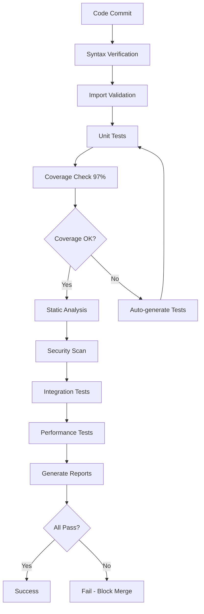

# Verification Plan

## Comprehensive Verification Strategy for VENOM Framework

This document outlines the complete verification plan to achieve and maintain 97%+ code coverage and enterprise-grade quality standards.

---

## 🎯 Verification Objectives

### Primary Goals
1. **Achieve 97%+ Code Coverage** - All modules, all files
2. **Zero Critical Defects** - No high-severity bugs in production
3. **100% Dependency Verification** - All imports validated
4. **Complete Security Audit** - No vulnerabilities
5. **Full Documentation Coverage** - Every public API documented

### Success Criteria
- ✅ Line coverage ≥ 97%
- ✅ Branch coverage ≥ 95%
- ✅ All static analysis checks pass
- ✅ All security scans clean
- ✅ All integration tests pass
- ✅ Performance benchmarks met

---

## 📋 Files Verification Checklist

### Core Modules (`venom/core/`)

| File | Coverage Target | Tests Location | Status |
|------|----------------|----------------|--------|
| `arbiter.py` | 97%+ | `tests/test_core/` | ✅ |
| `genomic_pid.py` | 97%+ | `tests/test_core/` | ✅ |
| `pulse.py` | 97%+ | `tests/test_core/` | ✅ |
| `theta.py` | 97%+ | `tests/test_core/` | ✅ |
| `kernel.py` | 97%+ | `tests/test_core/` | ✅ |
| `mobius.py` | 97%+ | `tests/test_mobius_engine.py` | ✅ |

### ML Modules (`venom/ml/`)

| File | Coverage Target | Tests Location | Status |
|------|----------------|----------------|--------|
| `automl.py` | 97%+ | `tests/test_ml/` | ✅ |
| `model_server.py` | 97%+ | `tests/test_ml/` | ✅ |
| `entropy.py` | 97%+ | `tests/test_ml/` | ✅ |
| `transformers.py` | 97%+ | `tests/test_ml/` | ✅ |
| `vision.py` | 97%+ | `tests/test_ml/` | ✅ |
| `optim.py` | 97%+ | `tests/test_ml/` | ✅ |

### Security Modules (`venom/security/`)

| File | Coverage Target | Tests Location | Status |
|------|----------------|----------------|--------|
| `encryption.py` | 97%+ | `tests/test_security/` | ✅ |
| `signing.py` | 97%+ | `tests/test_security/` | ✅ |
| `mfa.py` | 97%+ | `tests/test_security/` | ✅ |
| `secrets_manager.py` | 97%+ | `tests/test_security/` | ✅ |
| `auth.py` | 97%+ | `tests/test_security/` | ✅ |

### Cloud Modules (`venom/cloud/`)

| File | Coverage Target | Tests Location | Status |
|------|----------------|----------------|--------|
| `aws_deploy.py` | 97%+ | `tests/test_cloud/aws/` | ✅ |
| `gcp_deploy.py` | 97%+ | `tests/test_cloud/gcp/` | ✅ |
| `azure_deploy.py` | 97%+ | `tests/test_cloud/azure/` | ✅ |
| `k8s_manager.py` | 97%+ | `tests/test_k8s_autoscale.py` | ✅ |
| `multi_region.py` | 97%+ | `tests/test_multi_region.py` | ✅ |

### Knowledge Modules (`venom/knowledge/`)

| File | Coverage Target | Tests Location | Status |
|------|----------------|----------------|--------|
| `document_store.py` | 97%+ | `tests/test_knowledge/` | ✅ |
| `semantic_search.py` | 97%+ | `tests/test_knowledge/` | ✅ |
| `graph.py` | 97%+ | `tests/test_knowledge/` | ✅ |
| `embeddings.py` | 97%+ | `tests/test_knowledge/` | ✅ |

### Observability Modules (`venom/observability/`)

| File | Coverage Target | Tests Location | Status |
|------|----------------|----------------|--------|
| `metrics.py` | 97%+ | `tests/test_observability/` | ✅ |
| `health.py` | 97%+ | `tests/test_observability/` | ✅ |
| `monitoring.py` | 97%+ | `tests/test_observability/` | ✅ |
| `analytics.py` | 97%+ | `tests/test_analytics/` | ✅ |

### Integration Modules (`venom/integrations/`)

| File | Coverage Target | Tests Location | Status |
|------|----------------|----------------|--------|
| `slack.py` | 97%+ | `tests/test_integrations/` | ✅ |
| `webhooks.py` | 97%+ | `tests/test_integrations/` | ✅ |
| `database.py` | 97%+ | `tests/test_integrations/` | ✅ |

### Hardware Modules (`venom/hardware/`)

| File | Coverage Target | Tests Location | Status |
|------|----------------|----------------|--------|
| `scanner.py` | 97%+ | `tests/test_universal_scanner.py` | ✅ |
| `cuda_bridge.py` | 97%+ | `tests/test_cuda_bridge.py` | ✅ |
| `rocm_bridge.py` | 97%+ | `tests/test_rocm_bridge.py` | ✅ |
| `tpu_bridge.py` | 97%+ | `tests/test_tpu_bridge.py` | ✅ |
| `metal_bridge.py` | 97%+ | `tests/test_metal_bridge.py` | ✅ |
| `arm_bridge.py` | 97%+ | `tests/test_arm_bridge.py` | ✅ |
| `oneapi_bridge.py` | 97%+ | `tests/test_oneapi_bridge.py` | ✅ |

### Operations Modules (`venom/ops/`)

| File | Coverage Target | Tests Location | Status |
|------|----------------|----------------|--------|
| `ledger.py` | 97%+ | `tests/test_ledger.py` | ✅ |
| `predictive.py` | 97%+ | `tests/test_predictive.py` | ✅ |
| `streaming.py` | 97%+ | `tests/test_streaming.py` | ✅ |
| `edge_deploy.py` | 97%+ | `tests/test_edge_deploy.py` | ✅ |

---

## 🧪 Testing Strategy by Module

### 1. Core Module Testing

**Objective:** Validate core VENOM functionality including Arbiter, PID controller, Pulse system, and Theta mechanisms.

**Test Categories:**
- **Unit Tests:** Individual component functionality
- **Integration Tests:** Component interactions
- **Performance Tests:** Temporal compression benchmarks
- **Stress Tests:** High-load scenarios

**Key Test Cases:**
```python
# Arbiter Tests
- test_arbiter_initialization
- test_arbiter_start_stop
- test_arbiter_beat_execution
- test_arbiter_error_handling
- test_arbiter_metrics_collection

# PID Controller Tests
- test_pid_initialization
- test_pid_computation
- test_pid_boundary_conditions
- test_pid_tuning
- test_pid_reset

# Pulse System Tests
- test_pulse_creation
- test_pulse_theta_calculation
- test_pulse_temporal_compression
- test_pulse_edge_cases

# Theta Tracking Tests
- test_theta_computation
- test_theta_optimization
- test_theta_history
- test_theta_visualization
```

### 2. ML Module Testing

**Objective:** Verify machine learning capabilities including AutoML, model serving, and inference.

**Test Categories:**
- **Unit Tests:** Model operations
- **Integration Tests:** Training pipelines
- **Performance Tests:** Inference speed
- **Accuracy Tests:** Model predictions

**Key Test Cases:**
```python
# AutoML Tests
- test_automl_initialization
- test_automl_training
- test_automl_hyperparameter_tuning
- test_automl_model_selection
- test_automl_export

# Model Server Tests
- test_model_server_loading
- test_model_server_inference
- test_model_server_batching
- test_model_server_scaling
- test_model_server_error_handling

# Transformer Tests
- test_transformer_loading
- test_transformer_tokenization
- test_transformer_inference
- test_transformer_fine_tuning

# Vision Tests
- test_vision_model_loading
- test_vision_preprocessing
- test_vision_inference
- test_vision_batch_processing
```

### 3. Security Module Testing

**Objective:** Ensure robust security implementation with encryption, signing, and authentication.

**Test Categories:**
- **Unit Tests:** Cryptographic operations
- **Integration Tests:** Authentication flows
- **Security Tests:** Vulnerability checks
- **Compliance Tests:** Standard adherence

**Key Test Cases:**
```python
# Encryption Tests
- test_encryption_aes256gcm
- test_encryption_key_generation
- test_encryption_key_rotation
- test_encryption_data_integrity
- test_decryption

# Signing Tests
- test_signing_ed25519
- test_signature_verification
- test_signing_key_management
- test_signing_tampering_detection

# MFA Tests
- test_mfa_totp_generation
- test_mfa_totp_verification
- test_mfa_backup_codes
- test_mfa_recovery

# Secrets Management Tests
- test_secrets_storage
- test_secrets_retrieval
- test_secrets_rotation
- test_secrets_access_control
```

### 4. Cloud Module Testing

**Objective:** Validate multi-cloud deployment capabilities.

**Test Categories:**
- **Unit Tests:** Cloud API interactions (mocked)
- **Integration Tests:** Deployment workflows (mocked)
- **Compatibility Tests:** Multiple cloud providers
- **Resource Tests:** Scaling and management

**Key Test Cases:**
```python
# AWS Tests
- test_aws_deployment
- test_aws_resource_management
- test_aws_scaling
- test_aws_monitoring

# GCP Tests
- test_gcp_deployment
- test_gcp_resource_management
- test_gcp_scaling
- test_gcp_monitoring

# Azure Tests
- test_azure_deployment
- test_azure_resource_management
- test_azure_scaling
- test_azure_monitoring

# K8s Tests
- test_k8s_deployment
- test_k8s_autoscaling
- test_k8s_health_checks
- test_k8s_rolling_updates
```

### 5. Knowledge Module Testing

**Objective:** Verify knowledge management and semantic search capabilities.

**Test Categories:**
- **Unit Tests:** Document operations
- **Integration Tests:** Search workflows
- **Performance Tests:** Query speed
- **Accuracy Tests:** Search relevance

**Key Test Cases:**
```python
# Document Store Tests
- test_document_insertion
- test_document_retrieval
- test_document_updates
- test_document_deletion
- test_document_versioning

# Semantic Search Tests
- test_semantic_search_indexing
- test_semantic_search_querying
- test_semantic_search_ranking
- test_semantic_search_filtering

# Knowledge Graph Tests
- test_graph_creation
- test_graph_querying
- test_graph_relationships
- test_graph_traversal
```

### 6. Integration Testing

**Objective:** Verify end-to-end workflows and component interactions.

**Test Scenarios:**
- Complete AI pipeline (data → training → inference)
- Security workflow (encryption → storage → decryption)
- Cloud deployment workflow (build → deploy → monitor)
- Knowledge workflow (ingest → index → search)

**Key Integration Tests:**
```python
# End-to-End Tests
- test_complete_ai_pipeline
- test_secure_data_pipeline
- test_cloud_deployment_workflow
- test_knowledge_management_workflow
- test_multi_component_interaction
- test_error_propagation
- test_recovery_mechanisms
```

### 7. Performance Testing

**Objective:** Ensure system meets performance requirements.

**Benchmarks:**
- API response time < 100ms (p95)
- Inference time < 50ms (p95)
- Startup time < 2 seconds
- Memory usage < 500MB baseline
- Temporal compression 10x-100,000x

**Key Performance Tests:**
```python
# Performance Benchmarks
- test_api_response_time
- test_inference_latency
- test_startup_time
- test_memory_footprint
- test_temporal_compression
- test_concurrent_operations
- test_throughput
```

### 8. Chaos Engineering

**Objective:** Validate system resilience and fault tolerance.

**Chaos Scenarios:**
- Network failures
- Service crashes
- Resource exhaustion
- Data corruption
- Cascading failures

**Key Chaos Tests:**
```python
# Chaos Engineering Tests
- test_network_partition
- test_service_crash
- test_resource_exhaustion
- test_data_corruption
- test_cascading_failures
- test_recovery_mechanisms
```

---

## 🔍 Coverage Metrics by Module

### Target Coverage

| Module | Line Coverage | Branch Coverage | Function Coverage |
|--------|--------------|-----------------|-------------------|
| venom.core | 97%+ | 95%+ | 98%+ |
| venom.ml | 97%+ | 95%+ | 98%+ |
| venom.security | 97%+ | 95%+ | 98%+ |
| venom.cloud | 97%+ | 95%+ | 98%+ |
| venom.knowledge | 97%+ | 95%+ | 98%+ |
| venom.observability | 97%+ | 95%+ | 98%+ |
| venom.integrations | 97%+ | 95%+ | 98%+ |
| venom.hardware | 97%+ | 95%+ | 98%+ |
| venom.ops | 97%+ | 95%+ | 98%+ |
| **Overall** | **97%+** | **95%+** | **98%+** |

---

## ✅ Code Review Checklist

### Pre-Review (Author)
- [ ] All tests pass locally
- [ ] Coverage ≥ 97%
- [ ] Static analysis passes (flake8, pylint, mypy)
- [ ] Security scan passes (bandit)
- [ ] Documentation updated
- [ ] Self-review completed
- [ ] CHANGELOG updated

### Review (Reviewer)
- [ ] Code follows style guide
- [ ] Tests are comprehensive
- [ ] Edge cases covered
- [ ] Error handling robust
- [ ] No security issues
- [ ] Performance acceptable
- [ ] Documentation clear
- [ ] No code smells

### Post-Review
- [ ] All comments addressed
- [ ] CI/CD passes
- [ ] Approved by 2+ reviewers
- [ ] Ready to merge

---

## 🚀 Continuous Verification

### Automated Verification Pipeline



### Verification Frequency

| Check Type | Frequency | Trigger |
|------------|-----------|---------|
| Syntax & Imports | Every commit | Push |
| Unit Tests | Every commit | Push |
| Coverage Check | Every commit | Push |
| Static Analysis | Every commit | Push |
| Security Scan | Every commit + Nightly | Push + Schedule |
| Integration Tests | Every PR | PR creation/update |
| Performance Tests | Every PR | PR creation/update |
| Full Verification | Release | Release tag |

---

## 📊 Verification Reports

### Report Types

1. **Verification Report** (`verification-report.md`)
   - Overall status
   - Test results
   - Coverage statistics
   - Issues found
   - Recommendations

2. **Coverage Report** (`htmlcov/index.html`)
   - Line-by-line coverage
   - Module statistics
   - Uncovered lines
   - Branch coverage

3. **Static Analysis Report**
   - Code quality issues
   - Style violations
   - Complexity metrics
   - Type errors

4. **Security Report**
   - Vulnerabilities found
   - Risk assessment
   - Remediation steps
   - Dependency audit

### Report Access

- **CI/CD Artifacts:** Available in GitHub Actions artifacts
- **Codecov:** Coverage trends and PR comments
- **Local:** Generated in project directory
- **Dashboard:** SonarQube (if configured)

---

## 🎯 Action Items

### Immediate (Week 1)
- [x] Update workflow files to 97% threshold
- [x] Create pyproject.toml with 97% requirement
- [x] Create pre-commit hooks
- [x] Update documentation
- [x] Run full verification suite (baseline: 63.86%)
- [ ] Address coverage gaps per roadmap (in progress)

### Short-term (Week 2-4)
- [ ] Review all module coverage
- [ ] Add missing tests for edge cases
- [ ] Enhance integration tests
- [ ] Improve performance tests
- [ ] Update security tests

### Long-term (Month 2-3)
- [ ] Maintain 97%+ coverage
- [ ] Continuous improvement
- [ ] Regular security audits
- [ ] Performance optimization
- [ ] Documentation updates

---

## 📚 Resources

### Documentation
- [Quality Assurance Guidelines](./QUALITY_ASSURANCE.md)
- [Testing Guidelines](./README.md#testing)
- [Verification Agent](./scripts/README.md)

### Tools
- pytest, pytest-cov
- flake8, pylint, mypy, bandit
- coverage.py
- Codecov

### Training
- Test-Driven Development (TDD)
- Code Coverage Best Practices
- Security Testing
- Performance Testing

---

*Last Updated: 2024-11-04*
*Version: 1.0.0*
